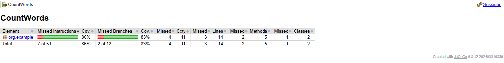
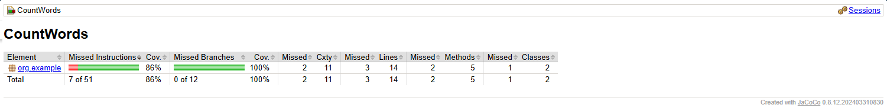
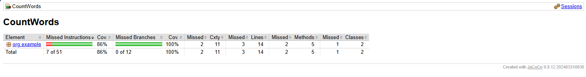
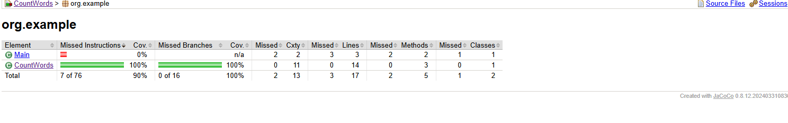
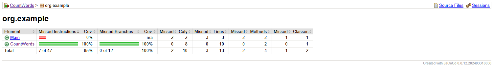
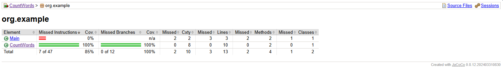
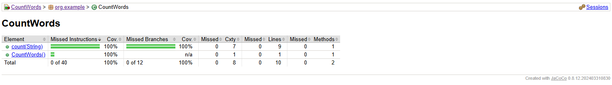
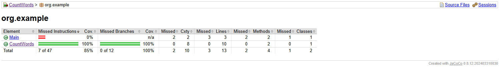

# CountWords

## Ejercicio 1

:question: **Pregunta**

Ahora, considera a un desarrollador que no sabe mucho sobre técnicas de prueba basadas en
especificaciones y escribe las siguientes dos pruebas JUnit para la implementación.  
CountWordTest.java:

```java
public class CountWords {  
    public int count(String str) {  
        int words = 0;  
        char last = ' ';  
  
        for (int i = 0; i < str.length(); i++) {  // 1  
            if (!isLetter(str.charAt(i)) && (last == 's' || last == 'r')) { // 2  
                words++;  
            }  
            last = str.charAt(i);  // 3  
        }  
        if (last == 'r' || last == 's') {  
            words++;   
        }  
    return words;  
    }
    
    private boolean isLetter(char c) { 
        return Character.isLetter(c); 
    } 
} 
```

:white_check_mark: **Repuesta**

Esta línea inicia un bucle for que recorre cada carácter de la cadena str. 
La variable i actúa como un índice que comienza en 0 y se incrementa en cada 
iteración hasta que alcanza el largo de la cadena (str.length()).

```text
    for (int i = 0; i < str.length(); i++) {  //1  
```

Esta línea contiene una sentencia if que verifica dos condiciones:

- `!isLetter(str.charAt(i))`: Esta condición utiliza el método isLetter para comprobar si el carácter actual 
(obtenido con str.charAt(i)) no es una letra. Si el carácter no es una letra, `!isLetter` será verdadero.
- `(last == 's' || last == 'r')`: Esta condición comprueba si el último carácter procesado (last) es una 's' o una 'r'.

Si ambas condiciones son verdaderas, se incrementa el contador de palabras (words++). 
Esto implica que se considera una palabra cada vez que se encuentra un carácter que no es una letra y el carácter anterior era 's' o 'r'.

```text
    if (!isLetter(str.charAt(i)) && (last == 's' || last == 'r')) { // 2  
```

`last = str.charAt(i);`
// 3: Esta línea actualiza la variable last para que almacene el carácter actual (str.charAt(i)).
Esto asegura que en la próxima iteración del bucle for, last contendrá el carácter procesado en la iteración actual.

```text
    last = str.charAt(i);  // 3  
```

## Ejercicio 2

:question: **Pregunta**

Explica qué hacen las líneas 1 y 2 del código. Presenta un informe generado por JaCoCo
(www.jacoco.org/jacoco) u otra herramienta de cobertura de código de tu preferencia en el IDE del
curso.

```java
    @Test  
    void twoWordsEndingWithS() {  // 1  
        int words = new CountWords().count("dogs cats");  
        assertThat(words).isEqualTo(2);  
    } 
    
    @Test  
    void noWordsAtAll() {  // 2  
        int words = new CountWords().count("dog cat");  
        assertThat(words).isEqualTo(0);  
    }
```

:white_check_mark: **Repuesta**

Este caso de prueba está diseñado para verificar si el método count de la clase CountWords 
cuenta correctamente dos palabras que terminan con 's'

```text
     void twoWordsEndingWithS() {  // 1 
```

Este caso de prueba está diseñado para verificar si el método count de la clase
CountWords cuenta correctamente cero palabras que terminan con 's' o 'r'.

```text
     void noWordsAtAll() {  // 2
```




## Ejercicio 3

:question: **Pregunta**

Explica la línea 1 y con el caso de prueba recién agregado en el conjunto de pruebas,
vuelve a ejecutar la herramienta de cobertura. Explica los cambios obtenidos.
Con el caso de prueba recién agregado en el conjunto de pruebas, vuelve a ejecutar la herramienta
de cobertura. Explica los cambios obtenidos y si hay partes del código que aún no estén cubiertas. 
Si existen, repite el proceso: identifica las partes no cubiertas, comprende por qué no están cubiertas 
y escribe una prueba que ejerza esa parte del código.

```java
@Test  
void wordsThatEndInR() {  // 1  
    int words = new CountWords().count("car bar");  
    assertThat(words).isEqualTo(2);  
}
```

:white_check_mark: **Repuesta**

Este caso de prueba está diseñado para verificar si el método count de la clase 
CountWords cuenta correctamente dos palabras que terminan con 'r'.

- `int words = new CountWords().count("car bar")`: Aquí se crea una instancia de CountWords 
y se llama al método count con la cadena "car bar". El resultado se almacena en la variable words.
- `assertThat(words).isEqualTo(2)`: Esta línea usa un método de aserción para verificar que el valor de words es igual a 2. 
Si el valor no es igual a 2, la prueba fallará, indicando que el método count no está funcionando como se esperaba para este caso.



## Ejercicio 4

### Parte A: Ánalisis de código

:question: **Pregunta**

Lee y comprende el siguiente código. Luego, responde las preguntas que siguen.

```java
public class CountWords {
    public int count(String str) {
        int words = 0;
        char last = ' ';

        for (int i = 0; i < str.length(); i++) {  // 1  
            if (!isLetter(str.charAt(i)) && (last == 's' || last == 'r')) { // 2  
                words++;
            }
            last = str.charAt(i);  // 3  
        }
        if (last == 'r' || last == 's') {
            words++;
        }
        return words;
    }
    private boolean isLetter(char c) {
        return Character.isLetter(c);
    }
} 
```

Preguntas:

1. Explica qué hacen las líneas 1, 2 y 3 en el código.
2. ¿Qué sucedería si se eliminara la línea 3 del código?
3. Escribe una descripción de alto nivel de lo que hace este método count.

:white_check_mark: **Repuesta**

**Explica qué hacen las líneas 1, 2 y 3 en el código.**

**Línea 1:**

```text
for (int i = 0; i < str.length(); i++) {
```

Esta línea inicia un bucle `for` que recorre cada carácter de la cadena `str`. 
La variable `i` actúa como un índice que comienza en 0 y se incrementa en cada 
iteración hasta que alcanza el largo de la cadena (`str.length()`).

**Línea 2:**

```text
if (!isLetter(str.charAt(i)) && (last == 's' || last == 'r')) {
```

Esta línea contiene una sentencia if que verifica dos condiciones:

- `!isLetter(str.charAt(i))`: Esta condición utiliza el método `isLetter` para comprobar si el carácter actual 
(obtenido con `str.charAt(i)`) no es una letra. Si el carácter no es una letra, `!isLetter` será verdadero.
- `(last == 's' || last == 'r')`: Esta condición comprueba si el último carácter procesado (last) es una 's' o una 'r'.

**Línea 3:**

```text
last = str.charAt(i);
```

Esta línea actualiza la variable last para que almacene el carácter actual (`str.charAt(i)`). 
Esto asegura que en la próxima iteración del bucle for, last contendrá el carácter procesado en la iteración actual.

**¿Qué sucedería si se eliminara la línea 3 del código?**

Si se eliminara la línea 3:

```text
last = str.charAt(i);
```

La variable `last` nunca se actualizaría con el carácter actual del bucle. 
Esto significaría que `last` mantendría su valor inicial (' ') durante todas las iteraciones. 
Como resultado, la condición `if (!isLetter(str.charAt(i)) && (last == 's' || last == 'r'))` nunca sería verdadera, 
porque last no cambiaría a 's' o 'r'. Además, la verificación final `if (last == 'r' || last == 's')` también fallaría. 
En resumen, el método nunca incrementaría el contador words, resultando en un valor de 0, 
independientemente del contenido de la cadena `str`.

**Escribe una descripción de alto nivel de lo que hace este método count.**

El método `count` de la clase `CountWords` cuenta el número de "palabras" en una cadena de texto que terminan con 
las letras 's' o 'r'. Una "palabra" se define como una secuencia de caracteres que termina con 's' o 'r' y es seguida 
por un carácter que no es una letra, o es la última letra de la cadena. El método recorre cada carácter de la cadena, 
verifica si el carácter actual no es una letra y si el carácter anterior era 's' o 'r'. Si ambas condiciones se cumplen, incrementa un contador de palabras. 
Además, realiza una verificación final para contar una palabra si la cadena termina con 's' o 'r'.

### Parte B: Pruebas

:question: **Pregunta**

Considera las siguientes pruebas unitarias:

Código: CountWordTest.java

```java
@Test  
void twoWordsEndingWithS() {  // 1  
    int words = new CountWords().count("dogs cats");  
    assertThat(words).isEqualTo(2);  
}  
@Test  
void noWordsAtAll() {  // 2  
    int words = new CountWords().count("dog cat");  
    assertThat(words).isEqualTo(0);  
} 
```

Preguntas:
4. Explica qué hacen las líneas 1 y 2 del código de prueba.
5. ¿Qué tipos de casos de prueba adicionales se deberían agregar para mejorar la cobertura?

:white_check_mark: **Repuesta**

**Explica qué hacen las líneas 1 y 2 del código de prueba.**

**Línea 1:**

```java
@Test  
void twoWordsEndingWithS() {  
    int words = new CountWords().count("dogs cats");  
    assertThat(words).isEqualTo(2);  
}
```

Esta línea define un caso de prueba llamado `twoWordsEndingWithS` que verifica si el método 
`count` de la clase `CountWords` cuenta correctamente dos palabras que terminan con la letra 's'.

- ` int words = new CountWords().count("dogs cats")`: Se crea una instancia de `CountWords` y
se llama al método `count` con la cadena "dogs cats". El resultado se almacena en la variable `words`.
- `assertThat(words).isEqualTo(2)`: Se usa una aserción para verificar que el valor de words es igual a 2. 
Si el valor no es igual a 2, la prueba fallará, indicando que el método `count` no está funcionando como se esperaba para este caso.

**Línea 2:**

```java
@Test  
void noWordsAtAll() {  
    int words = new CountWords().count("dog cat");  
    assertThat(words).isEqualTo(0);  
}
```

Esta línea define un caso de prueba llamado `noWordsAtAll` que verifica si el método `count` de la clase `CountWords` no 
cuenta ninguna palabra cuando no hay palabras que terminan con 's' o 'r'.

- `int words = new CountWords().count("dog cat")`: Se crea una instancia de CountWords y se llama al método `count` con la 
cadena "dog cat". El resultado se almacena en la variable words.
- `assertThat(words).isEqualTo(0)`: Se usa una aserción para verificar que el valor de words es igual a 0. 
Si el valor no es igual a 0, la prueba fallará, indicando que el método `count` no está funcionando como se esperaba para este caso.

**¿Qué tipos de casos de prueba adicionales se deberían agregar para mejorar la cobertura?**

Para mejorar la cobertura de pruebas y asegurar que todas las partes del método count estén 
adecuadamente probadas, se podrian agregar los siguientes casos de prueba:

**Prueba con caracteres no alfabéticos intermedios**

```java
@Test
void wordsWithNonAlphabeticCharacters() {  
    int words = new CountWords().count("dogs!car,cats.bar");  
    assertThat(words).isEqualTo(4);  
}
```

**Prueba con una cadena vacía**

```java
@Test
void emptyString() {  
    int words = new CountWords().count("");  
    assertThat(words).isEqualTo(0);  
}
```

### Parte C: Ejecución de Herramienta de Cobertura

:question: **Pregunta**

Ejecuta las pruebas unitarias usando JaCoCo o una herramienta de cobertura de código de tu
elección.

:white_check_mark: **Repuesta**



## Ejercicio 5

### Parte A: Nuevas pruebas

:question: **Pregunta**

Escribe nuevas pruebas unitarias para cubrir los casos que no están cubiertos actualmente. Usa el
siguiente formato como guía.

```java
@Test  
void wordsThatEndInR() {  // 1
    int words = new CountWords().count("car bar");
    assertThat(words).isEqualTo(2);  
}
```

:white_check_mark: **Repuesta**

#### Parte B: Ejecución de herramienta de cobertura

:question: **Pregunta**

1. Agrega las nuevas pruebas al conjunto de pruebas.
2. Vuelve a ejecutar la herramienta de cobertura.
3. Explica los cambios obtenidos en el informe de cobertura.
4. Si todavía hay partes del código no cubiertas, repite el proceso: 
identifica las partes no cubiertas, comprende por qué no están cubiertas 
y escribe una prueba que ejerza esa parte del código.

:white_check_mark: **Repuesta**

## Ejercicio 6: Exploración y mejora

### Parte A: Exploración

:question: **Pregunta**

1. Modifica el método count para mejorar su claridad o eficiencia.
2. Escribe pruebas unitarias adicionales para asegurar que las modificaciones no rompan la
   funcionalidad existente.

:white_check_mark: **Repuesta**

Clase CountWords mejorada:

```java
public class CountWords {
    public int count(String str) {
        int words = 0;
        char lastChar = ' ';

        for (int i = 0; i < str.length(); i++) {
            char currentChar = str.charAt(i);

            if (!isLetter(currentChar) && (lastChar == 's' || lastChar == 'r')) {
                words++;
            }

            lastChar = currentChar;
        }

        if (lastChar == 's' || lastChar == 'r') {
            words++;
        }

        return words;
    }

    private boolean isLetter(char c) {
        return Character.isLetter(c);
    }
}
```

Pruebas unitarias adicionales:

```java
 @Test
    void singleWordEndingInS() {
        int words = new CountWords().count("dogs");
        Assertions.assertThat(words).isEqualTo(1);
    }

    @Test
    void singleWordEndingInR() {
        int words = new CountWords().count("car");
        Assertions.assertThat(words).isEqualTo(1);
    }

    @Test
    void wordEndingInSFollowedByNonLetter() {
        int words = new CountWords().count("dogs! cats");
        Assertions.assertThat(words).isEqualTo(2); // "dogs" cuenta como una palabra
    }
```

### Parte B: Ejecución de herramienta de cobertura

:question: **Pregunta**

3. Genera un informe final de cobertura después de todas las modificaciones y nuevas pruebas.
4. Compara el informe final con el informe inicial y discute los cambios y mejoras en la
   cobertura de código.

:white_check_mark: **Repuesta**



## Ejercicio 7

:question: **Pregunta**

Presenta un gráfico de flujo de control (CFG) del programa CountWords.java.

:white_check_mark: **Repuesta**

// TODO: Agregar gráfico de flujo de control

## Ejercicio 8

:question: **Pregunta**

Asegura que cada línea de código en el método count de la clase CountWords esté cubierta por al
menos una prueba unitaria.

Implementa la clase CountWords según el siguiente código:

```java
public class CountWords {  
      public int count(String str) {  
          int words = 0;  
          char last = ' ';  
          for (int i = 0; i < str.length(); i++) {  
               if (!Character.isLetter(str.charAt(i)) && (last == 's' || last == 'r')) {  
                   words++;  
               }  
               last = str.charAt(i);  
          }  
          if (last == 'r' || last == 's') {  
               words++;   
          }  
          return words;  
     } 
}
```

- Escribe pruebas unitarias para cubrir cada línea del método count.
- Ejecuta las pruebas y verifica que todas las líneas del método count estén cubiertas usando
una herramienta de cobertura de código como JaCoCo.

:white_check_mark: **Repuesta**

Los test unitarios para cubrir cada línea del método count son los siguientes:

```java
import static org.assertj.core.api.Assertions.assertThat; 
import org.junit.jupiter.api.Test;

public class CountWordsTest {
     @Test 
     void testCountWordsEndingWithS() { 
          int words = new CountWords().count("dogs cats"); 
          assertThat(words).isEqualTo(2); 
      } 
     
     @Test 
     void testCountWordsEndingWithR() { 
          int words = new CountWords().count("car bar"); 
          assertThat(words).isEqualTo(2); 
      } 
      
     @Test 
     void testCountNoWordsEndingWithSOrR() { 
          int words = new CountWords().count("dog cat"); 
          assertThat(words).isEqualTo(0); 
      } 
      
     @Test 
     void testEmptyString() { 
          int words = new CountWords().count(""); 
          assertThat(words).isEqualTo(0); 
      } 
}
```

Ejecutamos las pruebas y verificamos la cobertura de código con JaCoCo:



## Ejercicio 9

:question: **Pregunta**

- Utiliza el mismo código de la clase `CountWords` del ejercicio anterior.
- Escribe pruebas unitarias para cubrir todas las ramas del método count.
- Ejecuta las pruebas y verifica que todas las ramas del método count estén cubiertas usando
  una herramienta de cobertura de código como JaCoCo.

:white_check_mark: **Repuesta**

```java
public class CountWordsTest {
    @Test
    void testCountWordsEndingWithS() {
        int words = new CountWords().count("dogs cats");
        Assertions.assertThat(words).isEqualTo(2);
    }

    @Test
    void testCountWordsEndingWithR() {
        int words = new CountWords().count("car bar");
        Assertions.assertThat(words).isEqualTo(2);
    }

    @Test
    void testCountNoWordsEndingWithSOrR() {
        int words = new CountWords().count("dog cat");
        Assertions.assertThat(words).isEqualTo(0);
    }

    @Test
    void testCountWordsWithSpecialCharacters() {
        int words = new CountWords().count("dog's car!");
        Assertions.assertThat(words).isEqualTo(2);
    }

    @Test
    void testEmptyString() {
        int words = new CountWords().count("");
        Assertions.assertThat(words).isEqualTo(0);
    }

    @Test
    void testCountSingleCharacterS() {
        int words = new CountWords().count("s");
        Assertions.assertThat(words).isEqualTo(1);
    }

    @Test
    void testCountSingleCharacterR() {
        int words = new CountWords().count("r");
        Assertions.assertThat(words).isEqualTo(1);
    }

    @Test
    void testCountSingleCharacterNonLetter() {
        int words = new CountWords().count("1");
        Assertions.assertThat(words).isEqualTo(0);
    }
}
```



## Ejercicio 10

:question: **Pregunta**

Asegurar que cada condición y cada rama del código en el método count esté cubierta por al menos
una prueba unitaria.

Instrucciones:

- Utiliza el mismo código de la clase CountWords del ejercicio anterior.
- Escribe pruebas unitarias para cubrir todas las condiciones y ramas del método count.

:white_check_mark: **Repuesta**

```java
public class CountWordsTest {

    @Test
    void testCountWordsEndingWithS() {
        int words = new CountWords().count("dogs cats");
        Assertions.assertThat(words).isEqualTo(2);
    }

    @Test
    void testCountWordsEndingWithR() {
        int words = new CountWords().count("car bar");
        Assertions.assertThat(words).isEqualTo(2);
    }

    @Test
    void testCountNoWordsEndingWithSOrR() {
        int words = new CountWords().count("dog cat");
        Assertions.assertThat(words).isEqualTo(0);
    }

    @Test
    void testCountWordsWithSpecialCharacters() {
        int words = new CountWords().count("dog's car!");
        Assertions.assertThat(words).isEqualTo(2);
    }

    @Test
    void testEmptyString() {
        int words = new CountWords().count("");
        Assertions.assertThat(words).isEqualTo(0);
    }

    @Test
    void testCountSingleCharacterS() {
        int words = new CountWords().count("s");
        Assertions.assertThat(words).isEqualTo(1);
    }

    @Test
    void testCountSingleCharacterR() {
        int words = new CountWords().count("r");
        Assertions.assertThat(words).isEqualTo(1);
    }

    @Test
    void testCountSingleCharacterNonLetter() {
        int words = new CountWords().count("1");
        Assertions.assertThat(words).isEqualTo(0);
    }

    @Test
    void testCountWordsEndingWithRAndS() {
        int words = new CountWords().count("runners dogs cars");
        Assertions.assertThat(words).isEqualTo(3);
    }

    @Test
    void testCountWordsEndingWithNeither() {
        int words = new CountWords().count("hello world");
        Assertions.assertThat(words).isEqualTo(0);
    }

    @Test
    void testCountWordsEndingWithSAndSpecialChar() {
        int words = new CountWords().count("dogs cats@");
        Assertions.assertThat(words).isEqualTo(2);
    }
} 
```



## Ejercicio 11: Cobertura de rutas

:question: **Pregunta**

Asegurar que todas las rutas posibles de ejecución en el método count estén 
cubiertas por al menos una prueba unitaria.

Instrucciones:

- Utiliza el mismo código de la clase CountWords del ejercicio anterior.
- Escribe pruebas unitarias para cubrir todas las rutas posibles del método count.

:white_check_mark: **Repuesta**

```java
public class CountWordsTest {

    @Test
    void testCountWordsEndingWithS() {
        int words = new CountWords().count("dogs cats");
        Assertions.assertThat(words).isEqualTo(2);
    }

    @Test
    void testCountWordsEndingWithR() {
        int words = new CountWords().count("car bar");
        Assertions.assertThat(words).isEqualTo(2);
    }

    @Test
    void testCountNoWordsEndingWithSOrR() {
        int words = new CountWords().count("dog cat");
        Assertions.assertThat(words).isEqualTo(0);
    }

    @Test
    void testCountWordsWithSpecialCharacters() {
        int words = new CountWords().count("dog's car!");
        Assertions.assertThat(words).isEqualTo(2);
    }

    @Test
    void testEmptyString() {
        int words = new CountWords().count("");
        Assertions.assertThat(words).isEqualTo(0);
    }

    @Test
    void testCountSingleCharacterS() {
        int words = new CountWords().count("s");
        Assertions.assertThat(words).isEqualTo(1);
    }

    @Test
    void testCountSingleCharacterR() {
        int words = new CountWords().count("r");
        Assertions.assertThat(words).isEqualTo(1);
    }

    @Test
    void testCountSingleCharacterNonLetter() {
        int words = new CountWords().count("1");
        Assertions.assertThat(words).isEqualTo(0);
    }

    @Test
    void testCountWordsEndingWithRAndS() {
        int words = new CountWords().count("runners dogs cars");
        Assertions.assertThat(words).isEqualTo(3);
    }

    @Test
    void testCountWordsEndingWithNeither() {
        int words = new CountWords().count("hello world");
        Assertions.assertThat(words).isEqualTo(0);
    }

    @Test
    void testCountWordsEndingWithSAndSpecialChar() {
        int words = new CountWords().count("dogs cats@");
        Assertions.assertThat(words).isEqualTo(2);
    }

    @Test
    void testCountWordsStartingWithNonLetter() {
        int words = new CountWords().count("1dogs 2cats");
        Assertions.assertThat(words).isEqualTo(2);
    }

    @Test
    void testCountWordsWithSpaces() {
        int words = new CountWords().count("dogs  cats");
        Assertions.assertThat(words).isEqualTo(2);
    }
}
```

