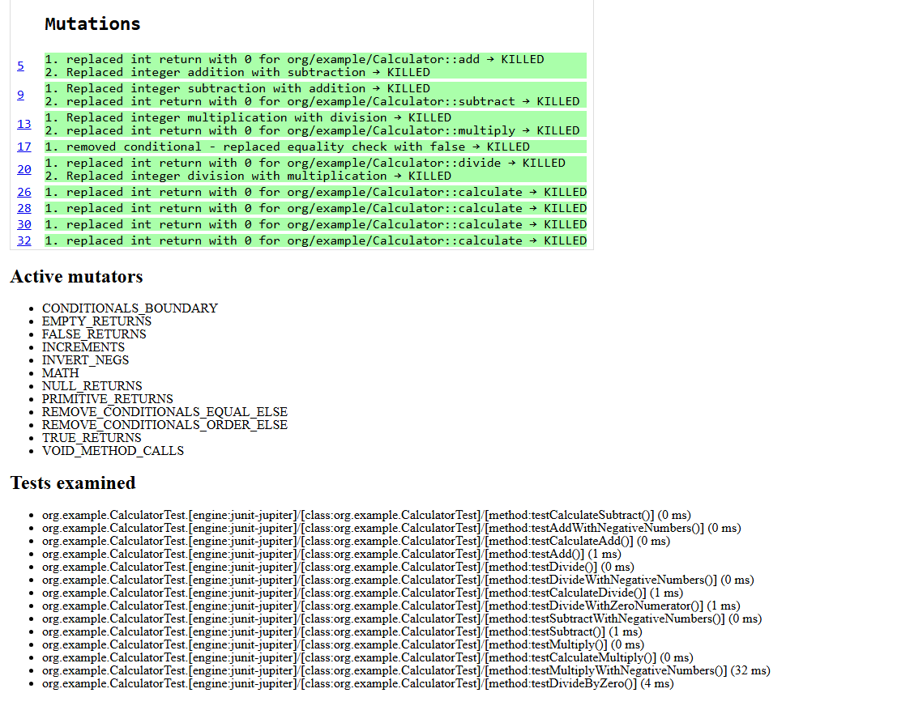

# Pruebas de Mutación

## Ejercicio 22: Comprender las Pruebas de Mutación

:question: **Pregunta**

Comprende los conceptos básicos y la terminología de las pruebas de mutación.
Instrucciones:

Define los siguientes términos

- Mutante
- Matar un mutante
- Sobrevivir un mutante
- Cobertura de mutación

Explica las dos suposiciones principales que hacen las pruebas de mutación

- Hipótesis del programador competente
- Efecto de acoplamiento

:white_check_mark: **Repuesta**

**Definiciones de Términos en Pruebas de Mutación**

**Mutante:**

Un mutante es una versión modificada del código original creada introduciendo pequeños cambios o errores deliberados (mutaciones) en el código fuente. 
Estos cambios pueden ser la alteración de operadores, la modificación de constantes, la eliminación de líneas de código, entre otros. 
El objetivo de los mutantes es evaluar la efectividad de los casos de prueba en detectar errores.

**Matar un mutante:**

Matar un mutante significa que un caso de prueba ha detectado el cambio o error introducido en el mutante, 
lo que resulta en una falla del test. Esto indica que el caso de prueba es efectivo para encontrar errores en el código.

**Sobrevivir un mutante:**

Un mutante sobrevive cuando los casos de prueba no logran detectar el cambio o error introducido, es decir, 
todos los casos de prueba pasan con éxito incluso con el código mutado. 
Esto sugiere que los casos de prueba no son lo suficientemente robustos para detectar ciertos tipos de errores en el código

**Cobertura de mutación:**

La cobertura de mutación es una métrica que mide la efectividad de un conjunto de casos de prueba en matar mutantes. 
Se calcula como el porcentaje de mutantes que han sido matados (detectados como errores) por los casos de prueba. 
Una alta cobertura de mutación indica que los casos de prueba son efectivos en detectar errores en el código.

**Explicación de las Suposiciones Principales en Pruebas de Mutación**

**Hipótesis del programador competente:**

La hipótesis del programador competente asume que los programadores suelen escribir código que está cerca de ser correcto. 
Esto implica que los errores que cometen los programadores son relativamente pequeños y simples de corregir. 
Por lo tanto, las mutaciones introducidas en el código también son pequeñas y simples, lo que ayuda a evaluar 
si los casos de prueba pueden detectar estos errores menores y comunes.

**Efecto de acoplamiento:**

El efecto de acoplamiento supone que los mutantes que son difíciles de detectar están acoplados a los errores reales que pueden existir en el código. 
Esto significa que si un caso de prueba es capaz de detectar (matar) mutantes, también es probable que sea capaz de 
detectar errores reales y más complejos en el código. En otras palabras, si los casos de prueba pueden identificar mutaciones simples, 
también deberían poder encontrar fallos más complejos y reales.

## Ejercicio 23: Introducción a PIT (Pitest)

:question: **Pregunta**

Configurar y ejecutar pruebas de mutación utilizando PIT en un proyecto Java.

Instrucciones:

- Configura un proyecto Java simple con las siguientes clases y pruebas unitarias:

**Clase: Calculator.java**

```java
public class Calculator { 
    public int add(int a, int b) { 
        return a + b; 
    } 
 public int subtract(int a, int b) { 
        return a - b; 
    } 
    public int multiply(int a, int b) { 
        return a * b; 
    } 
    public int divide(int a, int b) { 
        if (b == 0) { 
            throw new IllegalArgumentException("Divisor cannot be zero"); 
        } 
        return a / b; 
    } 
}
```

**Clase de Prueba: CalculatorTest.java**

```java
import static org.junit.jupiter.api.Assertions.*; 
import org.junit.jupiter.api.Test; 
  
public class CalculatorTest { 
  
    @Test 
    void testAdd() { 
        Calculator calc = new Calculator(); 
        assertEquals(5, calc.add(2, 3)); 
    } 
  
    @Test 
    void testSubtract() { 
        Calculator calc = new Calculator(); 
        assertEquals(1, calc.subtract(3, 2)); 
    } 
  
    @Test 
    void testMultiply() { 
        Calculator calc = new Calculator(); 
        assertEquals(6, calc.multiply(2, 3)); 
    } 
  
    @Test 
    void testDivide() { 
        Calculator calc = new Calculator(); 
        assertEquals(2, calc.divide(6, 3)); 
    } 
  
    @Test 
    void testDivideByZero() { 
        Calculator calc = new Calculator(); 
        Exception exception = assertThrows(IllegalArgumentException.class, () -> calc.divide(1, 0)); 
        assertEquals("Divisor cannot be zero", exception.getMessage()); 
    } 
}
```

- Configura PIT en tu proyecto siguiendo las instrucciones en Pitest Quick Start.
- Ejecuta PIT y genera un informe de mutación.
- Analiza el informe de mutación. ¿Cuántos mutantes fueron generados? ¿Cuántos mutantes fueron matados? ¿Cuántos sobrevivieron? ¿Qué mutantes sobrevivieron y por qué?

:white_check_mark: **Repuesta**

Configuración de PIT en un proyecto Java:

```gradle
plugins {
    id 'java'
    id 'info.solidsoft.pitest' version '1.15.0'
}

group = 'org.example'
version = '1.0-SNAPSHOT'

repositories {
    mavenCentral()
}

dependencies {
    testImplementation 'org.junit.jupiter:junit-jupiter-api:5.7.0'
    testRuntimeOnly 'org.junit.jupiter:junit-jupiter-engine:5.7.0'
    testImplementation 'org.junit.jupiter:junit-jupiter'
    testImplementation 'org.assertj:assertj-core:3.25.3'
    pitest 'org.pitest:pitest-junit5-plugin:1.1.0'
}

test {
    useJUnitPlatform()
}

pitest {
    targetClasses = ['org.example.*'] // Paquete de clases a mutar
    mutators = ['DEFAULTS'] // Conjunto de mutadores [OLD_DEFAULTS, DEFAULTS, STRONGER, ALL]
    outputFormats = ['HTML'] // Formato de salida del informe
    timestampedReports = false // Deshabilitar informes con marca de tiempo para facilitar la navegación
    verbose = true
}
```

Ejecución de PIT en el proyecto:

```bash
./gradlew pitest
```

Informe de mutación generado por PIT:


En total, se generaron 9 mutantes.

**add (Línea 5)**

1. replaced int return with 0 → KILLED
2. Replaced integer addition with subtraction → KILLED

**subtract (Línea 8)**

1. Replaced integer subtraction with addition → KILLED
2. replaced int return with 0 → KILLED

**multiply (Línea 11)**

1. Replaced integer multiplication with division → KILLED
2. replaced int return with 0 → KILLED

**divide (Líneas 14 y 17)**

1. removed conditional - replaced equality check with false → KILLED
2. replaced int return with 0 → KILLED
3. Replaced integer division with multiplication → KILLED

**Cuántos mutantes fueron matados:**

Todos los mutantes fueron matados. Ninguno de los 9 mutantes generados sobrevivió.

**¿Qué mutantes sobrevivieron y por qué?**

Ningún mutante sobrevivió, ya que todos los mutantes generados fueron matados por los casos de prueba existentes.

## Ejercicio 24: Mejorar el conjunto de pruebas

:question: **Pregunta**

Mejorar el conjunto de pruebas basado en el informe de mutación.
Instrucciones:

- Basándote en el informe de mutación generado en el ejercicio anterior, identifica las áreas donde los mutantes sobrevivieron.
-  Escribe pruebas adicionales para matar los mutantes sobrevivientes. Aquí hay algunas pistas: 
  + ¿Qué pasa si pruebas con números negativos?
  + ¿Qué sucede si pruebas con el número 0 en las operaciones add, subtract y multiply?

:white_check_mark: **Repuesta**

```java
    @Test
    void testAddWithNegativeNumbers() {
        Calculator calc = new Calculator();
        assertEquals(-1, calc.add(-2, 1));
    }

    @Test
    void testSubtractWithNegativeNumbers() {
        Calculator calc = new Calculator();
        assertEquals(-1, calc.subtract(-2, -1));
    }

    @Test
    void testMultiplyWithNegativeNumbers() {
        Calculator calc = new Calculator();
        assertEquals(-6, calc.multiply(-2, 3));
    }

    @Test
    void testDivideWithNegativeNumbers() {
        Calculator calc = new Calculator();
        assertEquals(-2, calc.divide(-6, 3));
    }

    @Test
    void testDivideWithZeroNumerator() {
        Calculator calc = new Calculator();
        assertEquals(0, calc.divide(0, 3));
    }
```

**¿Se han matado más mutantes?**

Con las pruebas adicionales, se mataron los siguientes mutantes:

**add (Línea 5)**

1. Replaced int return with 0 for org/example/Calculator::add → KILLED
2. Replaced integer addition with subtraction → KILLED

**subtract (Línea 8)**
1. Replaced integer subtraction with addition → KILLED
2. replaced int return with 0 for org/example/Calculator::subtract → KILLED

**multiply (Línea 11)**
1. Replaced integer multiplication with division → KILLED
2. Replaced int return with 0 for org/example/Calculator::multiply → KILLED

**divide (Líneas 14 y 17)**
1. removed conditional - replaced equality check with false → KILLED
2. replaced int return with 0 for org/example/Calculator::divide → KILLED
3. Replaced integer division with multiplication → KILLED

**¿Qué mutantes, si hay alguno, todavía sobreviven?**
No hay mutantes que sobrevivan después de agregar las pruebas adicionales.

**¿Qué pruebas adicionales podrían ser necesarias?**
Las pruebas adicionales podrían incluir casos de prueba para validar el comportamiento con números decimales,

## Ejercicio 25: Crear Mutantes manualmente

:question: **Pregunta**

Comprender cómo se generan los mutantes y probar manualmente si las pruebas los detectan.
Instrucciones:

- Modifica manualmente el código de la clase Calculator para introducir errores. Por ejemplo:

**Mutante 1: Cambiar el operador de adición a sustracción**

```java
public int add(int a, int b) { 
    return a - b; // Error intencional 
} 
```

**Mutante 2: Cambiar el operador de multiplicación a división**

```java
public int multiply(int a, int b) {
    return a / b; // Error intencional
}
```

- Ejecuta las pruebas unitarias y verifica que las pruebas fallen.
- Vuelve a corregir los errores y asegura que todas las pruebas pasen de nuevo.
- Reflexiona sobre cómo las pruebas de mutación ayudan a identificar la debilidad en los  conjuntos de pruebas.

:white_check_mark: **Repuesta**

Las pruebas de mutación son una técnica poderosa para evaluar la calidad y la robustez de un conjunto de pruebas unitarias.
Introduciendo mutantes, que son versiones ligeramente alteradas del código original con errores intencionales, y verificando 
si las pruebas existentes pueden detectar estos errores, se pueden identificar las debilidades en el conjunto de pruebas.

## Ejercicio 26: Análisis detallado de mutantes

:question: **Pregunta**

Analizar y clasificar los tipos de mutantes generados por PIT.

Instrucciones:
- Ejecuta PIT en el proyecto Calculator y genera un informe de mutación.
- Clasifica los mutantes generados en las siguientes categorías:
  + Mutantes aritméticos: Cambios en los operadores aritméticos (+, -, *, /).
  + Mutantes relacionales: Cambios en los operadores relacionales (<, >, <=, >=, ==, !=).
  + Mutantes lógicos: Cambios en los operadores lógicos (&&, ||, !).
  + Mutantes de asignación: Cambios en las asignaciones (=, +=, -=, *=, /=).
- Para cada categoría, identifica cuántos mutantes fueron generados, cuántos fueron matados
y cuántos sobrevivieron.
- Discute las razones por las cuales algunos mutantes sobrevivieron y sugiere mejoras en el conjunto de pruebas para matarlos.

:white_check_mark: **Repuesta**


**Mutantes Aritméticos**

Replaced integer addition with subtraction (en add) → KILLED
Replaced integer subtraction with addition (en subtract) → KILLED
Replaced integer multiplication with division (en multiply) → KILLED
Replaced integer division with multiplication (en divide) → KILLED

**Mutantes Matados:**
Todos los mutantes aritméticos fueron matados 4/4.

**Mutantes Relacionales**
Removed conditional - replaced equality check with false (en divide) → KILLED

**Mutantes Matados:**
El mutante relacional fue matado 1/1.

**Mutantes Condicionales:**
- removed conditional - replaced equality check with false.

**Mutantes Matados:**
- Todos estos mutantes fueron matados 1/1.

## Ejercicio 27

:question: **Pregunta**

Aplicar pruebas de mutación a un método más complejo para evaluar la solidez del conjunto de
pruebas.

Instrucciones:

- Agrega el siguiente método calculate a la clase Calculator:
- Escribe pruebas unitarias para el método calculate cubriendo todas las ramas y posibles errores
- Ejecuta PIT y genera un informe de mutación.
- Analiza el informe y realiza las mejoras necesarias en el conjunto de pruebas para alcanzar
una mayor cobertura de mutación.

:white_check_mark: **Repuesta**

Metodo calculate:

```java
public int calculate(String operation, int a, int b) { 
    switch (operation) { 
        case "add": 
            return add(a, b); 
        case "subtract": 
            return subtract(a, b); 
        case "multiply": 
            return multiply(a, b); 
        case "divide": 
            return divide(a, b); 
        default: 
            throw new IllegalArgumentException("Invalid operation"); 
    } 
}
```

Pruebas  unitarias para el método calculate:

```java
    @Test
    void testCalculateAdd() {
        Calculator calc = new Calculator();
        assertEquals(5, calc.calculate("add", 2, 3));
    }
    
    @Test
    void testCalculateSubtract() {
        Calculator calc = new Calculator();
        assertEquals(1, calc.calculate("subtract", 3, 2));
    }
    
    @Test
    void testCalculateMultiply() {
        Calculator calc = new Calculator();
        assertEquals(6, calc.calculate("multiply", 2, 3));
    }
    @Test
    void testCalculateDivide() {
        Calculator calc = new Calculator();
        assertEquals(2, calc.calculate("divide", 6, 3));
    }
    @Test
    void testCalculateInvalidOperation() {
        Calculator calc = new Calculator();
        Exception exception = assertThrows(IllegalArgumentException.class, () -> calc.calculate("mod",
                1, 1));
        assertEquals("Invalid operation", exception.getMessage());
}
```




**Mutantes Aritméticos:**
- Replaced integer addition with subtraction.
- Replaced integer subtraction with addition.
- Replaced integer multiplication with division.
- Replaced integer division with multiplication.

**Mutantes Matados:**
- Todos estos mutantes fueron matados. 4/4

**Mutantes Relacionales:**
- replaced int return with 0.

**Mutantes Matados:**
- Todos estos mutantes fueron matados. 1/1

**Mutantes Condicionales:**
- removed conditional - replaced equality check with false.

**Mutantes Matados:**
- Todos estos mutantes fueron matados. 1/1
